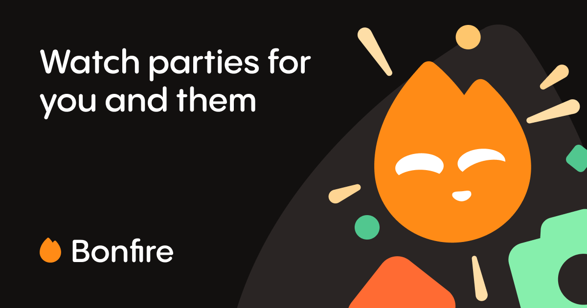
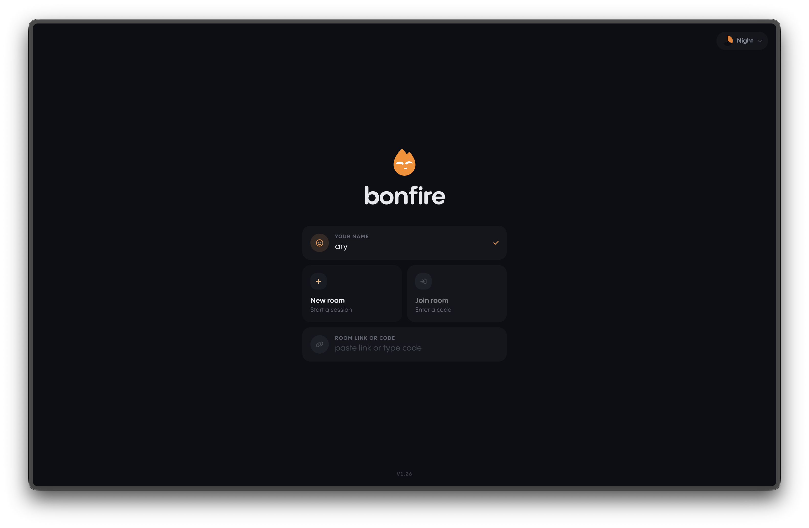
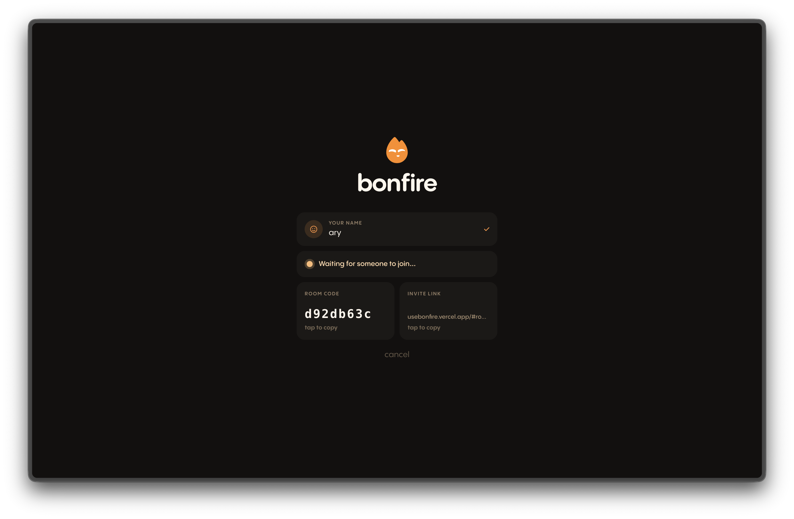
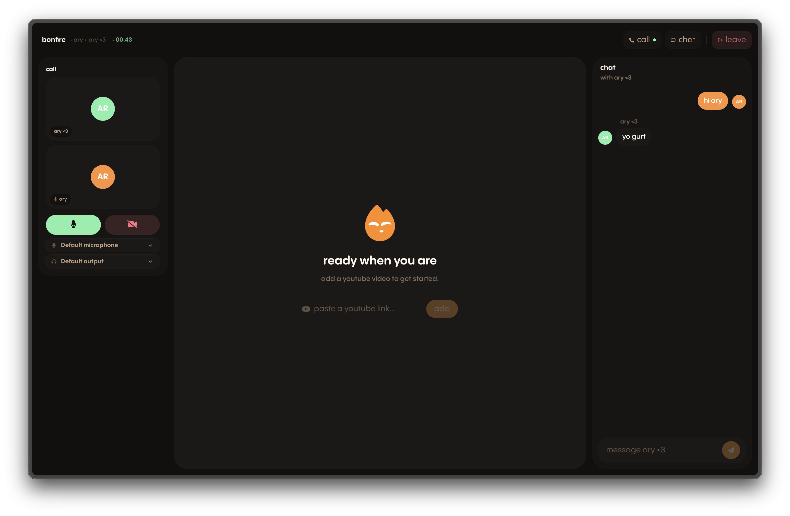

# Private peer-to-peer watch parties for two.

## How it works & Web RTC

It runs entirely peer-to-peer using WebRTC.  
Because WebRTC is peer-to-peer, the two browsers must exchange connection details (SDP offers and answers) to find each other. Bonfire achieves this using a Cloudflare Worker.

## Privacy

Signaling is entirely ephemeral, and once the connection is established, all traffic goes directly between the two browsers.  
No data is stored anywhere except for your nickname, which you enter at the start, before joining a call.

## Screens

## Experience

Experience Bonfire [here.](https://usebonfire.vercel.app/)

## Activities

| Activity | Description |
|----------|-------------|
| **YouTube** | Watch YouTube videos together, in sync. |
| **Screen Share** | Share your screen with the room. |
| **Spades of Streaming** | Browse and watch movies together on Spades of Streaming, my streaming service. |
| **Whiteboard** | Doodle and sketch together in real time. |
| **Photobooth** | Cut yourselves out and drop into the same background, almost like you're there together. |
| **Study** | Study together using a synced Pomodoro timer. |
| **Reminds Me of You** | Send them a song that reminds you of them. Built by [Niyikes](https://github.com/niyikes/reminds-me-of-you). |

## AI Usage

- debugging
- css
- prototyping video calls
- photobooth
- whiteboard bugs

Made with ❤️ by Ary 
Love to the point of creation